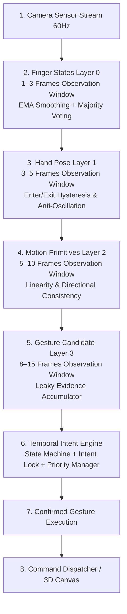
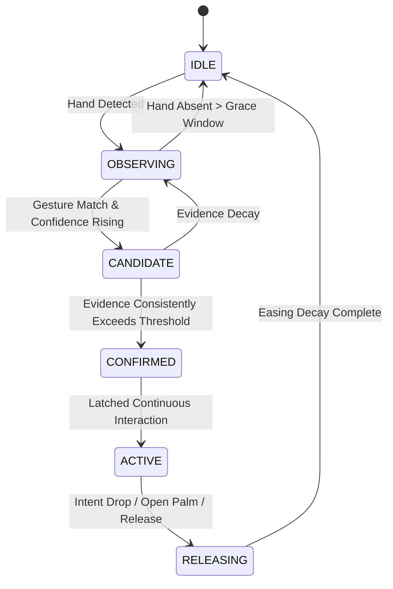

# Gestura Temporal Intent Engine — Specification & Architecture Guide

> **Core Principle: Interpretation requires evidence, not a single frame.**
> Gestura never reacts to a single frame. A spatial command is only dispatched when finger anatomy is stable, hand pose is confirmed across time, motion kinematics are consistent, confidence exceeds thresholds, and temporal observation validates user intent.

---

## 1. System Architecture Overview

Gestura replaces instantaneous per-frame reaction with a strict, unidirectional temporal perception pipeline where each layer must reach consensus before feeding the next:



### Observation Window Allocations

| Perception Layer | Frames | Purpose | Config Key |
| :--- | :---: | :--- | :--- |
| **Finger States (L0)** | 1–3 | Landmark jitter suppression, EMA filter, majority voting | `temporal_intent.windows.finger_window` |
| **Hand Poses (L1)** | 3–5 | Static pose stability confirmation, hysteresis | `temporal_intent.windows.pose_window` |
| **Motion Primitives (L2)** | 5–10 | Velocity vectors, tangential acceleration, linearity | `temporal_intent.windows.motion_window` |
| **Gesture Candidates (L3)** | 8–15 | Leaky evidence accumulation, stroke completion | `temporal_intent.windows.gesture_window` |
| **Two-Hand Gestures** | 10–20 | Bimanual temporal synchronization | `temporal_intent.windows.two_hand_window` |

---

## 2. Layer 0: Finger State Stabilization

Before any geometric pose is derived, raw sensor landmarks from MediaPipe are stabilized:

1. **Exponential Moving Average (EMA) Landmark Smoothing**:
   $$\mathbf{P}_{\text{smoothed}}^{(t)} = \alpha \cdot \mathbf{P}_{\text{raw}}^{(t)} + (1 - \alpha) \cdot \mathbf{P}_{\text{smoothed}}^{(t-1)}$$
   Configured by `temporal_intent.finger.landmark_smoothing_alpha = 0.65`.
   Sudden large jumps ($> 0.45$ screen units) indicate camera re-acquisition or hand entry and snap cleanly without lag.

2. **Temporal Majority Voting**:
   Over the 1–3 frame rolling window, digit states (`extended`, `folded`, `curved`, `touching`, etc.) are tracked per digit. A state is only accepted when its frequency across the window meets or exceeds:
   $$\text{Ratio} \ge \tau_{\text{majority}} = 0.67$$
   Isolated 1-frame tracking glitches or occlusion blips are mathematically rejected.

3. **Output Schema**:
   ```json
   {
     "thumb": "extended",
     "index": "folded",
     "middle": "folded",
     "ring": "folded",
     "little": "extended",
     "confidence": 0.97,
     "is_stable": true
   }
   ```

---

## 3. Layer 1: Hand Pose Confirmation with Hysteresis

Instantaneous static hand poses are never acted upon directly. Rapid transitions and visual flickering between adjacent poses (such as `POINT` and `PEACE`) are prevented through **hysteresis** and multi-frame consistency:

1. **Enter vs. Exit Thresholds**:
   - **Entering a Pose**: Requires $\ge 3$ consecutive frames of agreement with pose confidence $\ge \tau_{\text{enter}} = 0.80$.
   - **Exiting / Dropping a Pose**: Once confirmed, a pose remains active even if confidence fluctuates, dropping only when confidence falls strictly below $\tau_{\text{exit}} = 0.45$.
2. **Oscillation Detection**:
   Rapid alternations ($> 3$ switches in the last 10 frames) trigger an oscillation suppression penalty, holding the previous stable pose until the hand settles.

---

## 4. Layer 2: Motion Primitive Analyzer

Hand motion is evaluated **strictly independently of hand pose**. Calculating kinetics separately prevents accidental hand travel during pose formation from being misinterpreted as intentional strokes:

### Key Metrics
- **Instantaneous & Smoothed Velocity**:
  $$\mathbf{v}^{(t)} = \frac{\mathbf{x}^{(t)} - \mathbf{x}^{(t-1)}}{\Delta t}$$
- **Tangential Acceleration**:
  $$a_t = \frac{\|\mathbf{v}^{(t)}\| - \|\mathbf{v}^{(t-2)}\|}{\Delta t}$$
- **Net Displacement vs. Cumulative Path Length**:
  $$\text{Net} = \|\mathbf{x}_{\text{end}} - \mathbf{x}_{\text{start}}\|, \quad \text{Path} = \sum_{i=1}^N \|\mathbf{x}_i - \mathbf{x}_{i-1}\|$$
- **Trajectory Linearity**:
  $$\Lambda = \frac{\text{Net}}{\text{Path}} \in [0, 1]$$
- **Directional Consistency**:
  $$\bar{C} = \frac{1}{N-1} \sum_{i=2}^N \frac{\mathbf{v}_i \cdot \mathbf{v}_{i-1}}{\|\mathbf{v}_i\| \|\mathbf{v}_{i-1}\|}$$

### Swipe Validation Filter
A stroke is validated as an intentional swipe if and only if:
1. Confirmed hand pose is valid.
2. Speed exceeds $\tau_{\text{velocity}} = 1.8\text{ u/s}$.
3. Net displacement exceeds $\tau_{\text{distance}} = 0.14\text{ m}$.
4. Directional consistency $\bar{C} \ge 0.85$ (rejecting curved or circular trajectories).
5. Linearity $\Lambda \ge 0.70$ (rejecting waving or accidental repositioning).

---

## 5. Layer 3–5: Intent State Machine & Lifecycle

Every interaction follows a formal 6-state lifecycle:



### State Contract

| State | Purpose | Command Dispatch Behavior |
| :--- | :--- | :--- |
| **IDLE** | No hands or resting posture | Zero commands dispatched. |
| **OBSERVING** | Hand in frame; collecting temporal baseline | Zero commands dispatched. |
| **CANDIDATE** | Pose and motion evidence accumulating (frames 1–7) | Zero commands dispatched. |
| **CONFIRMED** | Evidence satisfies thresholds ($\ge \tau_{\text{confirm}}$) | Dispatches exactly one trigger event. |
| **ACTIVE** | Sustained continuous interaction (Pinch drag, dial, zoom) | Continuous delta streaming (translation, scale, rotation). |
| **RELEASING** | Hand unclenching, pose opening, or confidence dropping | Graceful easing decay ($0.85^k$ multiplier). Never snap abruptly. |

---

## 6. Intent Lock System

To prevent gesture hijacking during delicate continuous interactions (such as dragging a 3D graph node or orbiting the camera):

1. **Acquiring Lock**:
   When entering `ACTIVE` under `PINCH`, `DRAG`, or `BIMANUAL` manipulation, the system acquires an exclusive lock.
2. **Suppression Rules**:
   While locked, all conflicting secondary gestures are suppressed:
   - Swipes (`SWIPE_LEFT`, `SWIPE_RIGHT`, etc.) $\rightarrow$ **IGNORED**.
   - Fists and Grabs $\rightarrow$ **IGNORED**.
   - Point hovers $\rightarrow$ **IGNORED**.
3. **Compatible Families**:
   Only gestures belonging to the active interaction family (e.g. `PINCH_SELECT`, `PINCH_DRAG`, `PINCH_ZOOM`, `RELEASE`) remain permitted.
4. **Safety Timeout**:
   If no interaction event is received for $> 3.0\text{ s}$, the lock automatically releases.

---

## 7. Priority Hierarchy Engine

When multiple gesture candidates emerge simultaneously, conflicts are resolved via strict 5-tier arbitration:

| Priority Tier | Category | Gestures Included | Arbitration Rule |
| :---: | :--- | :--- | :--- |
| **Tier 1** | **Pinch Selection** | `PINCH`, `PINCH_SELECT`, `PINCH_DRAG`, `PINCH_ZOOM` | Preempts all lower tiers. Holds exclusive interaction lock. |
| **Tier 2** | **Two-Hand Manipulation** | `BIMANUAL_ZOOM`, `TWO_HAND_PINCH`, `TWO_HAND_ROTATION` | Preempts single-hand swipes and hovers. |
| **Tier 3** | **Swipe Gestures** | 1F–5F Swipes (Up, Down, Left, Right) | Suppressed if Pinch or Two-Hand manipulation is active. |
| **Tier 4** | **Point Hover** | `INDEX_POINT`, `DOUBLE_POINT`, cursor targeting | Suppressed if any higher tier gesture initiates. |
| **Tier 5** | **Idle** | Resting hand, neutral observation | Fallback state. |

---

## 8. Graceful Release & Exponential Easing

Gestura rejects sudden, jarring cutoffs when a user releases a grip:

$$\text{Easing Factor}^{(t)} = \text{Easing Factor}^{(t-1)} \cdot \gamma_{\text{decay}}$$

- **Decay Constant**: $\gamma_{\text{decay}} = 0.85$ per frame.
- **Cooldown Window**: 5 consecutive frames.
- **Spatial Transformation Result**:
  When rotating the 3D globe or translating objects in Three.js, camera velocities and position deltas decay smoothly according to $\text{Easing Factor} \in [1.0 \rightarrow 0.0]$, ensuring a cinematic, tactile user experience.

---

## 9. Developer Debug Overlay

The web visualizer includes a glassmorphic HUD directly on the live camera viewport providing full explainability:

- **Layer 0 (Fingers)**: Digit states `[T, I, M, R, L]`, landmark confidence, tracking jitter score, stability pill.
- **Layer 1 (Pose)**: Active pose, candidate pose, hysteresis confidence score, frame consensus count (`3/5`).
- **Layer 2 (Motion)**: Tangential velocity, net displacement, trajectory linearity (`LIN`), directional consistency (`CONS`), movement duration.
- **Layer 3–5 (Intent)**: Intent state machine pill (`IDLE`, `OBSERVING`, `CANDIDATE`, `CONFIRMED`, `ACTIVE`, `RELEASING`), priority badge (`TIER 1–5`), intent lock badge (`LOCKED (PINCH)` vs `UNLOCKED`), easing factor.
- **Explainability Strip**: Human-readable narrative detailing why an action was confirmed, pending, or rejected (e.g. *"Accumulating temporal consensus for SWIPE_RIGHT (window: 8-15 frames)"*).

---

## 10. Configuration Reference (`configs/default_config.yaml`)

```yaml
temporal_intent:
  enabled: true
  windows:
    finger_window: 3        # 1-3 frames: jitter suppression
    pose_window: 5          # 3-5 frames: pose stability confirmation
    motion_window: 8        # 5-10 frames: directional kinematics
    gesture_window: 12      # 8-15 frames: intentional gesture validation
    two_hand_window: 16     # 10-20 frames: bimanual synchronization

  finger:
    landmark_smoothing_alpha: 0.65
    temporal_majority_threshold: 0.67
    jitter_suppression_radius: 0.008

  pose:
    enter_threshold: 0.80   # High confidence required to confirm pose
    exit_threshold: 0.45    # Hysteresis: low threshold required to drop pose
    min_confirm_frames: 4
    max_oscillation_history: 10

  motion:
    min_velocity: 0.25
    stationary_dwell_ms: 400.0

  swipe:
    min_velocity: 1.8
    min_distance: 140.0
    min_direction_consistency: 0.85
    min_linearity: 0.70
    min_duration_ms: 120.0
    max_duration_ms: 650.0

  intent_fsm:
    activation_threshold: 0.85
    candidate_threshold: 0.50
    release_threshold: 0.35
    confirm_frames: 4
    release_cooldown_frames: 5
    easing_decay_rate: 0.85
    hand_loss_timeout_sec: 0.40

  priority:
    pinch_select_rank: 1
    two_hand_rank: 2
    swipe_rank: 3
    point_hover_rank: 4
    idle_rank: 5
```

---

## 7. Multi-Level Intention Deciphering Architecture

In accordance with Section XIII of the Gesture Bible, Gestura deciphers user intention across all 4 perceptual levels rather than executing raw geometry:

* **Level 0 (Fingers)**: Micro-intentions (`POINTING_TARGETING`, `CONTACT_OPPOSITION`, `SUPPORT_BASE`, `DYNAMIC_TRIGGER`, etc.) and focal digit determination (`is_focal`, `focus_weight`, `focal_role`). Folded fingers are identified as `SUPPORT_BASE` and filtered from jittering the interaction target.
* **Level 1 (Poses)**: Pose interaction intention (`TARGETING_RAYCAST`, `SELECTION_PREPARATION`, `MANIPULATION_ENGAGED`, `SYSTEM_CONFIRMATION`, etc.) and `intended_action` semantic goal.
* **Level 2 (Motion)**: Kinetic intention (`NAVIGATIONAL_STROKE`, `OBJECT_TRANSLATION`, `ROTATIONAL_DIAL`, `APPROACH_ENGAGEMENT`) and purposeful gating (`is_purposeful`, `intentionality_score`). **Filters out accidental drift, arm drops, and fatigue wandering (`ACCIDENTAL_REPOSITIONING`)**.
* **Level 3 (Gestures)**: Task intention (`SELECT_NODE`, `DRAG_AND_DROP`, `SWIPE_NAVIGATE`, `ORBIT_CAMERA`, `AIR_TAP_TRIGGER`, etc.) and predictive sequence anticipation (`predicted_next_intent`).

### Unified Multi-Level Explainability Trace
```text
L0[Index (0.95)] ➔ L1[TARGETING_RAYCAST] ➔ L2[APPROACH_ENGAGEMENT (purposeful=True)] ➔ L3[AIR_TAP_TRIGGER (next: RETURN_TO_AIM)]
```

