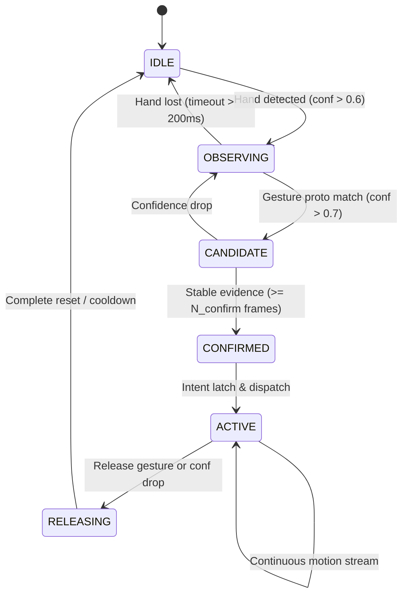

# Methodology & Mathematical Formulation

## 1. Landmark Normalization and Feature Space

Let $\mathbf{L} = \{\mathbf{p}_i\}_{i=0}^{20}$ be the set of 21 raw 3D landmarks in normalized camera image coordinates, where $\mathbf{p}_i = (x_i, y_i, z_i) \in [0, 1]^2 \times \mathbb{R}$.

### 1.1 Scale and Translation Invariance
To decouple hand geometry from distance to the camera and image position:
1. **Palm Center Coordinate**:
   $$\mathbf{p}_{\text{palm}} = \frac{1}{4}(\mathbf{p}_0 + \mathbf{p}_5 + \mathbf{p}_9 + \mathbf{p}_{17})$$
   where indices correspond to: Wrist (0), Index MCP (5), Middle MCP (9), and Pinky MCP (17).
2. **Hand Characteristic Scale Reference**:
   $$d_{\text{ref}} = \|\mathbf{p}_0 - \mathbf{p}_9\|_2$$
   which represents the palm length from wrist to middle metacarpophalangeal joint.
3. **Normalized Landmark Coordinates**:
   $$\tilde{\mathbf{p}}_i = \frac{\mathbf{p}_i - \mathbf{p}_{\text{palm}}}{d_{\text{ref}}}, \quad \forall i \in \{0, \dots, 20\}$$

### 1.2 Kinematic Finger Extension & State Metrics
For each finger $f \in \{\text{Thumb, Index, Middle, Ring, Pinky}\}$ with tip index $T_f$, PIP index $P_f$, and MCP index $M_f$:
- **Finger Extension Ratio**:
  $$E_f = \frac{\|\mathbf{p}_{T_f} - \mathbf{p}_0\|_2}{\|\mathbf{p}_{M_f} - \mathbf{p}_0\|_2}$$
- **Joint Flexion Angle**:
  $$\theta_f = \arccos\left(\frac{(\mathbf{p}_{T_f} - \mathbf{p}_{P_f}) \cdot (\mathbf{p}_{M_f} - \mathbf{p}_{P_f})}{\|\mathbf{p}_{T_f} - \mathbf{p}_{P_f}\|_2 \|\mathbf{p}_{M_f} - \mathbf{p}_{P_f}\|_2}\right)$$
- **Pinch Metric (Thumb Tip to Finger Tip)**:
  $$D_{\text{pinch}}(f) = \frac{\|\mathbf{p}_4 - \mathbf{p}_{T_f}\|_2}{d_{\text{ref}}}$$
  A continuous pinch confidence $c_{\text{pinch}} \in [0, 1]$ is modeled via a smooth sigmoid function:
  $$c_{\text{pinch}} = \frac{1}{1 + \exp\left(k \cdot (D_{\text{pinch}} - D_{\text{threshold}})\right)}$$
  where $k = 18.0$ and $D_{\text{threshold}} = 0.35$.

---

## 2. Temporal Intent Estimation Architecture

### 2.1 Multi-Stage State Machine
The interaction state $\mathcal{S}_t \in \{\text{IDLE}, \text{OBSERVING}, \text{CANDIDATE}, \text{CONFIRMED}, \text{ACTIVE}, \text{RELEASING}\}$ transitions according to temporal confidence integration and state latching:

### 2.2 Evidence Accumulation & Confidence Calibration
Let $c_t \in [0, 1]$ be the instantaneous gesture confidence at frame $t$. The cumulative temporal evidence $\mathcal{E}_t$ is updated via leaky exponential accumulation:
$$\mathcal{E}_t = \lambda \mathcal{E}_{t-1} + (1 - \lambda) c_t$$
where $\lambda \in [0.75, 0.90]$ controls the temporal smoothing horizon.

Confidence calibration error is minimized using Platt scaling / temperature scaling:
$$\hat{P}(g \mid \mathbf{z}) = \sigma\left(\frac{w^\top \phi(\mathbf{z}) + b}{T}\right)$$
where $T > 0$ is the learned calibration temperature parameter.

---

## 3. 3D Spatial Coordinate Mapping & Interaction Kinematics

### 3.1 Five-Stage Coordinate Transformation Pipeline
1. **Camera Image Space**: $(u_{\text{px}}, v_{\text{px}}) \in [0, W_{\text{img}}] \times [0, H_{\text{img}}]$
2. **Normalized Camera Space**:
   $$u_{\text{norm}} = 1.0 - \frac{u_{\text{px}}}{W_{\text{img}}}, \quad v_{\text{norm}} = 1.0 - \frac{v_{\text{px}}}{H_{\text{img}}}$$
   *(horizontal flip applied for natural mirror-interaction ergonomics)*
3. **Normalized Interaction Viewport Space**:
   $$x_{\text{ndc}} = 2 \cdot u_{\text{norm}} - 1.0 \in [-1, 1], \quad y_{\text{ndc}} = 2 \cdot v_{\text{norm}} - 1.0 \in [-1, 1]$$
4. **Ray Casting into 3D World**:
   $$\mathbf{r}_{\text{origin}} = \mathbf{C}_{\text{cam}}$$
   $$\mathbf{r}_{\text{dir}} = \text{normalize}\left(\mathbf{K}^{-1} \begin{bmatrix} x_{\text{ndc}} \\ y_{\text{ndc}} \\ 1 \end{bmatrix}\right)$$
5. **Ray-Sphere Intersection on Interactive Globe**:
   For a globe centered at $\mathbf{O} \in \mathbb{R}^3$ with radius $R$:
   $$\|\mathbf{r}_{\text{origin}} + t \mathbf{r}_{\text{dir}} - \mathbf{O}\|^2 = R^2$$
   Solving the quadratic equation yields the exact 3D interaction point $\mathbf{P}_{\text{surface}}$.

---

## 4. Adaptive Filtering & Motion Smoothing

### 4.1 One-Euro Filter Formulation for Spatial Cursor & Quaternion Rotation
For position $\mathbf{x} = [x, y, z]^\top$:
1. **Discrete Velocity Estimation**:
   $$\dot{\mathbf{x}}_k = \frac{\mathbf{x}_k - \hat{\mathbf{x}}_{k-1}}{T_e}$$
2. **Filtered Velocity**:
   $$\hat{\dot{\mathbf{x}}}_k = \alpha_d \dot{\mathbf{x}}_k + (1 - \alpha_d) \hat{\dot{\mathbf{x}}}_{k-1}, \quad \alpha_d = \frac{2\pi f_{c,d} T_e}{2\pi f_{c,d} T_e + 1}$$
3. **Dynamic Position Cutoff Frequency**:
   $$f_c = f_{c,\min} + \beta \|\hat{\dot{\mathbf{x}}}_k\|_2$$
4. **Filtered Position Output**:
   $$\hat{\mathbf{x}}_k = \alpha \mathbf{x}_k + (1 - \alpha) \hat{\mathbf{x}}_{k-1}, \quad \alpha = \frac{2\pi f_c T_e}{2\pi f_c T_e + 1}$$
   Default parameters: $f_{c,\min} = 1.0\text{ Hz}$, $\beta = 0.007$, $f_{c,d} = 1.0\text{ Hz}$.
